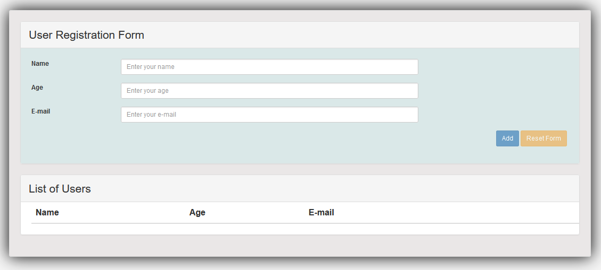
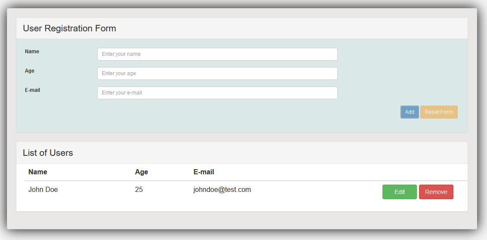
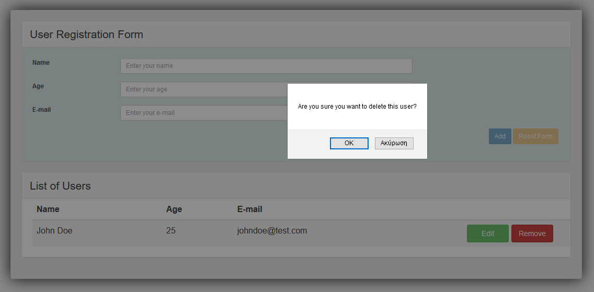
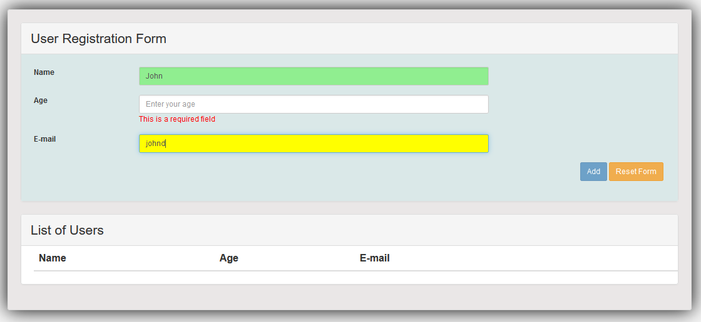

# spring-angularjs-crud
<b>User Registration Form - Spring Boot and AngularJS</b>
  
  
<b>Description:</b>

A simple one-page application that performs CRUD operations and is used for user registration.
It uses <b>Spring Boot</b> and <b>MySQL</b> in the backend and <b>AngularJS</b> in the frontend.

  
<b>Technologies used:</b>
 
<ol>
	<li>Spring Boot</li>
	<li>Spring MVC</li>
	<li>Spring Data JPA</li>
	<li>Spring REST</li>
	<li>Apache Maven</li>
	<li>AngularJS</li>
	<li>MySQL database</li>
</ol>

# 

  

	<kbd></kbd>
	  
	<b>Image 1 - Main form</b>

  
  

	<kbd></kbd>
	  
	<b>Image 2 - Add user</b>

  
  

	<kbd></kbd>
	  
	<b>Image 3 - Delete user</b>

  
  

	<kbd></kbd>
	  
	<b>Image 4 - Filling the fields & warnings</b>

  
  